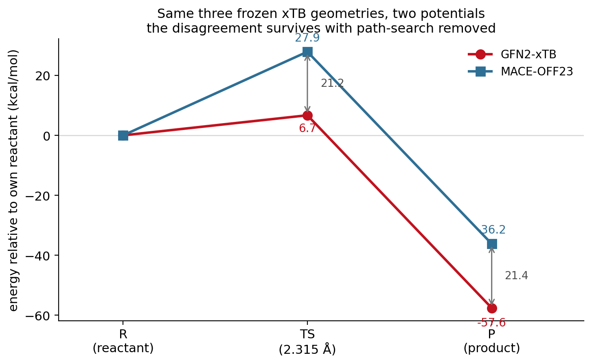

This is the detailed study behind [Pillar 2 — Reactive chemistry](p2-reactive.qmd). The
pillar page carries the headline argument; this page keeps the full methodology,
tables, convergence tests, and the troubleshooting that is worth recording.

## 1 · Baseline reaction benchmark {#sec-baseline}

Using the same RMSD machinery pulled *toward* a product (`xtb --path`), the reaction
runs: both new C–C σ-bonds form. But the path's reported "barrier" (101 kcal/mol) is a
**biased-path artifact** — the driver had to escalate the bias to connect. A relaxed
concerted scan plus a Sella saddle optimization gives the real answer.

| Quantity | Value |
|----------|-------|
| Forming C–C at TS | 2.32 Å (symmetric) |
| Imaginary frequency | −394 cm⁻¹ (exactly one) |
| **Concerted barrier** | **6.7 kcal/mol** (scan and Sella agree) |
| Reaction energy | −57.6 kcal/mol |
| Stepwise (first bond) barrier | 19.3 kcal/mol — concerted is preferred |
| ~~`--path` "barrier"~~ | ~~101 kcal/mol~~ — not physical |

{width=560}

::: {.callout-tip}
## Ties back to the metadynamics theme
Enhanced sampling *finds* that a transition is reachable, but a quantitative barrier
needs a proper TS treatment — the RMSD bias alone is chemically blind. (Also: xtb has
no TS optimizer — `--optts` is not a flag; use Sella. And read the `vibspectrum` file
for frequencies, not the `--hess` stdout.)
:::

[Full findings — FINDINGS_diels_alder.md →](https://github.com/tiangroup-uofa/xtb_metadynamics/blob/main/sweep/diels_alder/FINDINGS_diels_alder.md)

## 2 · Mechanism and energetics {#sec-mechanism}

Does the MACE-OFF23 surrogate get reaction *energetics* right with **no fine-tuning**?
xTB has a built-in path search; MACE doesn't, so we build the profile with a
climbing-image **NEB** (ASE) and compare.

| quantity | GFN2-xTB (built-in path) | MACE-OFF23 (NEB) |
|----------|:------------------------:|:----------------:|
| activation barrier | 6.7 kcal/mol | **36.2 kcal/mol** |
| reaction energy | −57.6 kcal/mol | **−36.1 kcal/mol** |
| TS forming C–C | 2.32 Å | 2.03 / 1.98 Å (slightly asynchronous) |

{width=760}

**Outcome (2): same TS location (~2.0–2.3 Å), very different energetics.**
Experiment/DFT give a barrier ≈ 22–27 kcal/mol and ΔH ≈ −40. GFN2-xTB badly
underestimates the barrier (6.7) and overbinds the product (−57.6); MACE-OFF23
(DFT-trained) is closer on both, off the shelf. The refined MACE TS is a genuine
first-order saddle (one imaginary mode, −740 cm⁻¹) and slightly **asynchronous** —
MACE makes the perfectly synchronous geometry a second-order saddle.

Both potentials agree the reaction is a **concerted, synchronous** cycloaddition — the
two forming bonds contract together (b1 ≈ b2 along the whole path), with only MACE's TS
marginally asynchronous (2.03 / 1.98 Å). They differ in energetics, not mechanism.

{width=680}

**Literature context:** experiment gives a barrier ≈ 27.5 and ΔH ≈ −40 kcal/mol. xTB
(6.7 / −57.6) is qualitatively wrong on both; MACE-OFF23 (36 / −36…−41) nails the
reaction energy and is in the right kinetic regime, though it overestimates the barrier
by ~9 kcal/mol.

## 3 · Where the potentials diverge {#sec-divergence}

The disagreement is a **reactive-region** effect. The energy difference
ΔE = E_MACE − E_xTB is ~0 for the separated reactants, grows as the bonds form, peaks
in the TS region, and leaves a persistent ~+23 kcal/mol product offset — **not a
constant shift.**

{width=680}

And the forces: on rattled reaction-path geometries the MACE and xTB force vectors are
**directionally almost identical (cosine 0.98)**, but the **magnitude gap (RMSE) spikes
in the TS region** — exactly where the energy difference peaks.

{width=680}

### Region-wise error partition

152 rattled path geometries partitioned into five regions by forming C–C distance,
with raw MACE-vs-xTB force RMSE, cosine, and energy discrepancy per region.

| region (forming C–C) | force RMSE (eV/Å) | cosine | ΔE vs reactant (kcal/mol) |
|---|:---:|:---:|:---:|
| reactant basin (>2.9 Å) | 0.39 | 0.996 | 0 (ref) |
| pre-TS rising (2.4–2.9) | 0.43 | 0.991 | 8.7 |
| **TS region (1.96–2.4)** | **0.83** | **0.950** | **36.5** |
| **post-TS (1.7–1.96)** | **0.96** | 0.964 | 31.3 |
| product basin (<1.7 Å) | 0.33 | 0.997 | 23.1 |

{width=680}

::: {.callout-note}
## Careful with the "why"
That the errors *concentrate* in the distorted barrier region is directly measured
here. The natural explanation — that such highly distorted geometries are
under-represented in the foundation model's training distribution — is a **supported
hypothesis, not a demonstrated fact**; this dataset shows *where* the error is, not
*why*. It motivates, but does not prove, targeted data enrichment.
:::

::: {.callout-note}
## What this tells the correction framework
MACE and xTB agree on geometry, mechanism, and force *direction* (cosine 0.98) and
disagree on energy/force *magnitude*, **localized in the bond-forming region.** So a
global energy shift is ruled out (ΔE is zero at the reactant); the direction-agrees /
magnitude-differs signature points to a **force-scaling** correction, and the
localization points to an **environment/coordination-dependent** (or delta) form. The
NEB pipeline already wraps every potential in a `CorrectedCalculator` with these
plug-in models — see [Study 08](08-corrections.qmd).
:::

## 4 · Methodological controls {#sec-controls}

The obvious objection to the ~30 kcal/mol gap: MACE used NEB, xTB used its built-in
path search, so maybe the gap is a **path-method mismatch**. Three controls close that
off.

### MACE's barrier is method-invariant

Across the relaxed scan (36.0), the Sella saddle (36.2), and a standardized 13-image
CI-NEB (36–37), MACE gives the same answer. It is also numerically converged —
**35.9 ± 1.0 kcal/mol for ≥11 NEB images** (9 images is too few: the barrier collapses
to ~18 and the TS drifts to 2.5 Å).

{width=560}

### The xtb-python stability gate

Before running xTB through the same NEB driver, the backend was gated: single-points,
forces, and geometry optimization are reproducible, with repeat-evaluation energy
scatter of **5.08e−14 eV** (machine precision), a converged optimization at fmax 0.021,
and ~4.4 ms per call. The robust settings (`electronic_temperature=1000`,
`max_iterations=500`, `accuracy=1.0`) do not perturb path energetics.

### xTB ASE-NEB fails under the standardized settings

Running *both* potentials through the identical 13-image CI-NEB (k = 0.5, FIRE /
`NEBOptimizer`, fmax 0.05, climbing image, same concerted-scan seed): MACE converges,
xTB does **not**. The band never forms a sensible path — atoms in the "TS" images fly
apart (reported forming C–C of ~7–18 Å) and the apparent barrier balloons to
**240–250 kcal/mol** under both optimizers.

{width=720}

::: {.callout-important}
## A PES/algorithm compatibility issue, not a backend failure
The same `xtb-python` that passed the stability gate produces a clean single-point
everywhere; only the *band optimization* on xTB's flatter, low-barrier surface diverges
under these settings, and a file-based binary xTB would hit the identical problem. So
the valid xTB reference stays the constrained relaxed scan + verified TS
(6.7 kcal/mol). **Because MACE's barrier is the same ~36 kcal/mol no matter how it is
computed, the ~30 kcal/mol gap is a genuine difference between the two
potential-energy surfaces — not the original path-method mismatch.**
:::

[Jul 31 follow-up findings — FINDINGS_jul31.md →](https://github.com/tiangroup-uofa/xtb_metadynamics/blob/main/sweep/diels_alder/FINDINGS_jul31.md)

## 5 · Cross-PES transition-state validation {#sec-cross-pes}

If path search is not the explanation, the sharper question is whether the two
potentials even share a transition state.

### Geometry verification

All three structures were confirmed as the exact geometries associated with the
reported 6.7 kcal/mol result: C₆H₁₀ throughout, matched atom ordering, forming pairs
(0,5) and (3,4). Reactant `start.xyz` (3.35 Å forming C–C), TS `ts_opt.xyz` (2.315 Å,
Sella-refined and Hessian-verified), product `end.xyz` (1.54 Å new σ-bonds).

### Identical frozen geometries

Evaluating both potentials on those exact structures, with no relaxation, removes path
search as a variable entirely.

| on frozen xTB geometries | GFN2-xTB | MACE-OFF23 | difference |
|---|:---:|:---:|:---:|
| barrier | **6.7 kcal/mol** | **27.9 kcal/mol** | 21.2 |
| reaction energy | −57.6 | −36.2 | 21.4 |
| max atomic force at the TS | 0.00093 eV/Å | **1.84 eV/Å** | — |
| force norm at the TS | — | 4.11 eV/Å | — |

{width=620}

The xTB TS is a true stationary point on xTB's surface but carries **1.84 eV/Å** of
MACE force — nearly 40× a typical 0.05 eV/Å convergence threshold. **It is not a
stationary point on the MACE surface.**

### The MACE saddle, found from the xTB TS

Using the xTB TS as the initial guess for a Sella saddle search on MACE:

| | GFN2-xTB saddle | MACE saddle (Sella from the xTB TS) |
|---|:---:|:---:|
| forming C–C | 2.315 Å | **1.976 / 2.031 Å (mean 2.004)** |
| barrier | 6.7 kcal/mol | **35.8 kcal/mol** |
| imaginary modes | 1 (−394 cm⁻¹) | 1 |
| convergence | — | 66 iterations, fmax 8.0e−6 eV/Å |
| displacement between the two saddles | — | 0.316 Å |

{width=760}

This recovered saddle agrees with the *independently obtained* CI-NEB result
(35.8 vs 36.0 kcal/mol; 2.004 vs 2.005 Å mean forming C–C) — two different methods from
two different starting points converging on the same structure.

### δx robustness

Displacing the MACE saddle along its imaginary mode and re-running Sella from each
perturbed structure:

| perturbation | iterations | final fmax (eV/Å) | RMSD to reference (Å) | barrier (kcal/mol) |
|---|:---:|:---:|:---:|:---:|
| −0.05 Å | 38 | 8.9e−6 | 5.0e−6 | 35.806 |
| −0.02 Å | 30 | 9.3e−6 | 2.4e−6 | 35.806 |
| +0.02 Å | 37 | 8.9e−6 | 1.6e−6 | 35.806 |
| +0.05 Å | 61 | 9.1e−6 | 1.6e−6 | 35.806 |
| **spread** | — | — | **< 1e−5** | **0.000** |

All four recover the same saddle. It is well isolated, not an optimizer artifact.

::: {.callout-note}
## Hessian convention
The Phase 1 Hessian was mass-*unweighted*, so its eigenvalue→cm⁻¹ conversion produced a
non-physical magnitude. The *count* of imaginary modes was unaffected (mass weighting is
a congruence transform and preserves the sign structure by Sylvester's law of inertia),
and no conclusion depended on the numeric value. Later work uses a properly
mass-weighted Hessian, validated by reproducing xTB's own `vibspectrum` value at the
xTB TS: **−394.1 cm⁻¹** against the reference −394, with the six translation/rotation
modes cleanly separated (next-lowest −13.3 cm⁻¹).
:::

## 6 · Final interpretation {#sec-interpretation}

**Directly demonstrated.** On identical frozen geometries the two potentials disagree by
21.2 kcal/mol on the barrier; the xTB TS is not a MACE stationary point (1.84 eV/Å);
Sella from that TS converges to a genuine first-order MACE saddle 0.316 Å away at
35.8 kcal/mol, matching the independent NEB result; and that saddle is robustly
recovered from ±0.05 Å perturbations with zero barrier spread.

**Supported interpretation.** The two surfaces describe nearby but distinct saddle
regions. The barrier disagreement is intrinsic to the potentials rather than an
artifact of methodology or convergence.

**Not demonstrated.** Which method is physically more accurate cannot be settled from
this experiment — though DFT/experiment (≈22–27 kcal/mol) sits between them, closer to
MACE. Nothing here establishes that the foundation model's training set lacks these
geometries, and nothing transfers automatically to other reactions.

Two claims that are easy to conflate stay separate: **nearby TS geometry** and
**matching TS energy** are different achievements, and this system has the first
without the second.

[Phase 1 complete findings — PHASE1_COMPLETE_FINDINGS.md →](https://github.com/tiangroup-uofa/xtb_metadynamics/blob/main/sweep/diels_alder/PHASE1_COMPLETE_FINDINGS.md) ·
[NEB findings — FINDINGS_neb.md →](https://github.com/tiangroup-uofa/xtb_metadynamics/blob/main/sweep/diels_alder/FINDINGS_neb.md)
