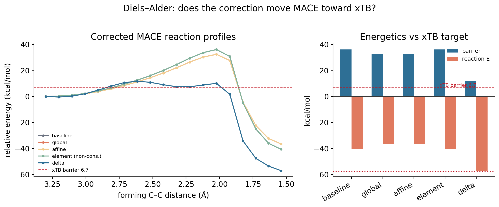
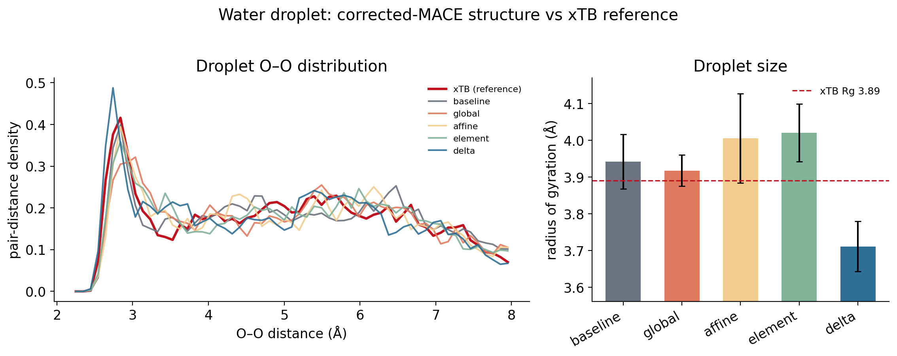

The Diels–Alder benchmark (Study 04) showed MACE and xTB agree on force *direction*
but differ in *magnitude*, localized in the reactive region. Here we test whether a
**lightweight post-training correction** — fit on paired MACE/xTB forces, no
foundation-model retraining — can remove that systematic error. Base = MACE-OFF23,
target = GFN2-xTB (a cheap stand-in for the eventual DFT reference); all via the
existing `CorrectedCalculator`.

Four models: **global** (F′=αF), **affine** (+energy shift), **element** (per-element
force scaling, *non-conservative*), and a conservative **delta** (energy = fitted
radial pair potentials, forces = −∇, linear least-squares fit).

## Results

| model | val force RMSE ↓ | DA barrier | DA ΔE | droplet Rg (Å) | conservative |
|---|:---:|:---:|:---:|:---:|:---:|
| baseline (MACE) | ref | 36.0 | −40.6 | 3.94 | yes |
| global / affine | 8% | 32.3 | −36.5 | 3.9–4.0 | yes |
| element | 9% | 36.0 (inert) | −40.6 | 4.02 | **no** |
| **delta** | **16%** | **11.7** | **−57.1** | 3.71 | yes |
| **xTB (target)** | — | **6.7** | **−57.6** | **3.89** | — |

### Forces: corrections fix magnitude, not direction
Force direction is already aligned (cosine 0.985); the delta removes the most
magnitude error (16%), scalar corrections ~8–9%.

{width=620}

### Diels–Alder: the delta is transformative, the others are not
A modest force improvement yields a large **energetics** correction — the delta
captures the bonding-region residual that integrates into the reaction energetics:
reaction energy −40.6 → **−57.1** (target −57.6, essentially exact) and barrier
36 → **11.7** (target 6.7). Scalar corrections only apply α; element-scaling is
energetically inert.

{width=760}

### Water: MACE was already right; corrections don't help (and can hurt)
Baseline MACE already matches the xTB droplet; no correction improves agreement,
and the delta slightly **over-compacts** it (Rg 3.71 vs 3.89) — the reactive-data-
dominated correction mildly degrades the already-good equilibrium.

{width=760}

::: {.callout-important}
## Recommendation
Use the **conservative pairwise delta** for future active-learning / metadynamics:
it is the only correction that removes the systematic *energetics* error (what
matters for reactions and free energies), it is **conservative** (MD-safe), and it
is a lightweight linear fit — no foundation-model retraining. Avoid element-force
scaling (non-conservative, energetically inert); global/affine are safe but too
weak. Caveat: fit the delta on data representative of the deployment domain (it
over-compacts water when dominated by reactive data), and a ~5 kcal/mol barrier
residual remains for a richer model / eventual fine-tuning to close.
:::

[Full findings — FINDINGS_corrections.md →](https://github.com/tiangroup-uofa/xtb_metadynamics/blob/main/sweep/corrections/FINDINGS_corrections.md)

## Jul 31 follow-up (Aug 7) — targeted barrier-region calibration

The barrier-region error analysis ([Study 04](04-diels-alder.qmd)) showed the
MACE↔xTB disagreement concentrates in the TS / post-TS region. So: does
**concentrating the correction data there** help more than adding the *same amount*
of generic data? We fit the **same** conservative pairwise-delta (identical
architecture and hyperparameters — only the training data changes), with a strict
no-leakage split **by parent path geometry** (test geometries never enter any fit):

- **baseline delta** — reactive + water configs;
- **barrier-enriched delta** — baseline + 32 configs at forming C–C ≈ 1.7–2.4 Å;
- **generic control** — baseline + 32 configs sampled generically (same count).

| model | DA barrier (kcal/mol) | reaction E | TS forming C–C |
|---|:---:|:---:|:---:|
| raw MACE | 36.0 | −40.6 | 2.02 Å |
| baseline delta | 14.1 | −47.3 | 2.02 Å |
| **barrier-enriched delta** | **9.9** | −50.7 | 2.62 Å |
| generic control (equal count) | 15.0 | −51.1 | 2.02 Å |
| **xTB (target)** | **6.7** | **−57.6** | 2.32 Å |

- **Targeted beats generic at equal data budget.** Adding barrier-region data moved
  the barrier 14.1 → **9.9**; the *same number* of generic configs did essentially
  nothing (14.1 → 15.0). The barrier-enriched delta **removes ~89% of the raw
  MACE→xTB barrier gap**.
- **Held-out barrier-region forces improve.** On the parent-split held-out reactive
  test, TS+post-TS force RMSE drops from 0.906 (raw) to **0.688** (barrier-enriched,
  −24%), lower than both baseline (0.714) and the generic control (0.734). The cost
  is a small increase in *overall* RMSE (0.432 → 0.456) — the fixed-capacity delta
  reallocates toward the barrier.
- **Energetic agreement improves more than geometric agreement.** The corrected TS
  shifts *outward* to ~2.62 Å (vs xTB's 2.32 Å), so the barrier height matches far
  better than the TS position does — worth flagging honestly.

{width=680}

{width=760}

### Water is not degraded

Repeating the droplet benchmark, the barrier-enriched delta gives **exactly the
same water structure as the baseline delta** (Rg 3.82 Å, O–O peak 2.74 Å for both;
raw MACE 3.90, xTB 3.77) — barrier enrichment does not harm the equilibrium
subsystem. The reason is structural: the pairwise delta has **separate channels per
element pair**, so the added C–C/C–H barrier data touches only the carbon channels
and leaves the O–O/O–H channels that govern water untouched — clean selectivity.

{width=760}

::: {.callout-important}
## Jul 31–Aug 7 takeaway
**Errors are concentrated in distorted reactive configurations, and targeted
calibration of those regions is more effective than adding the same amount of
generic data.** What this does **not** claim: no active-learning loop was run (this
is a static, hand-placed enrichment — it *motivates* active sampling, it does not
implement it); no improvement in *physical* (DFT) accuracy is claimed — xTB is the
chosen reference here, not the true target, and for this reaction it under-barriers
relative to DFT/experiment; and we do not assert the foundation model's training
set definitely lacks these geometries. Those remain future work and open
hypotheses.
:::

[Jul 31 follow-up findings — FINDINGS_jul31.md →](https://github.com/tiangroup-uofa/xtb_metadynamics/blob/main/sweep/diels_alder/FINDINGS_jul31.md)
