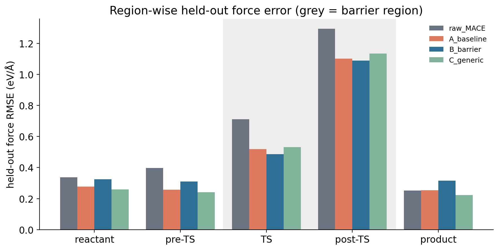
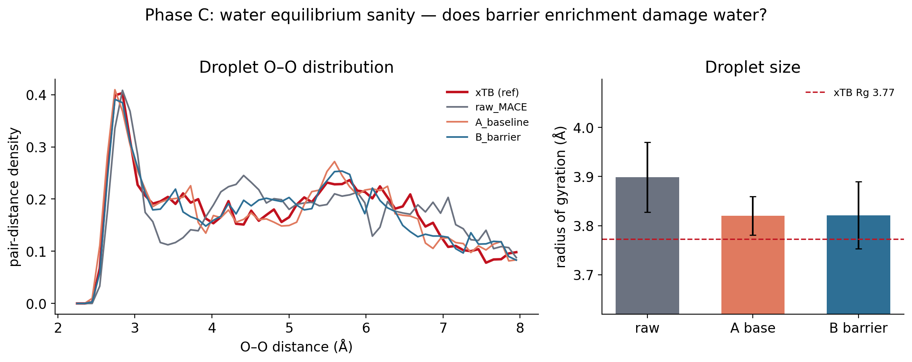
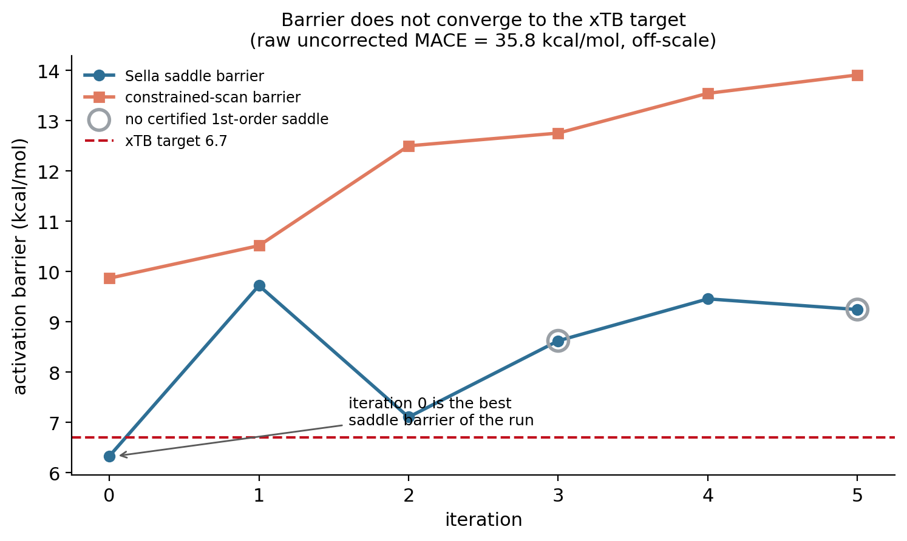
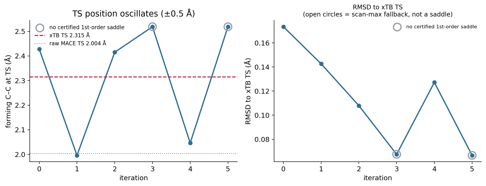
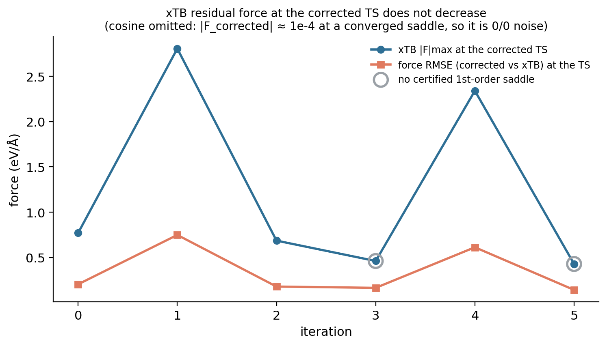
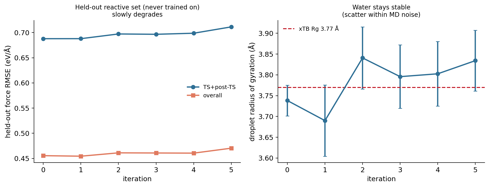

This is the detailed study behind [Pillar 3 — Post-training correction](p3-correction.qmd)
and [Pillar 4 — Iterative calibration](p4-iterative.qmd). Those pages carry the
argument; this page keeps the full tables, controls, and limitations.

## 1 · Motivation {#sec-motivation}

The Diels–Alder benchmark ([Study 04](04-diels-alder.qmd)) showed MACE and xTB agree on
force *direction* but differ in *magnitude*, localized in the reactive region. A
systematic, localized residual is the kind of thing a small model can absorb. The
question is whether a **lightweight post-training correction** — fit on paired
MACE/xTB forces, with no foundation-model retraining — can remove it.

Base = MACE-OFF23, target = GFN2-xTB (a cheap stand-in for the eventual DFT reference);
all applied through the existing `CorrectedCalculator`, which leaves the foundation
model untouched.

## 2 · Correction architectures {#sec-architectures}

Four models: **global** (F′ = αF), **affine** (+ energy shift), **element**
(per-element force scaling, *non-conservative*), and a conservative **delta** (energy =
fitted radial pair potentials, forces = −∇, linear least-squares fit).

The delta is a sum of Gaussian radial basis functions per element pair — 48
coefficients across 6 pair channels, 3.6 Å cutoff, ridge 1e−3 — fit on the force
residual F_xTB − F_MACE. Because it is an energy expression differentiated
analytically, it is conservative and therefore MD- and metadynamics-safe.

## 3 · Initial benchmark {#sec-benchmark}

| model | val force RMSE ↓ | DA barrier (scan max) | DA ΔE | droplet Rg (Å) | conservative |
|---|:---:|:---:|:---:|:---:|:---:|
| baseline (MACE) | ref | 36.0 | −40.6 | 3.94 | yes |
| global / affine | 8% | 32.3 | −36.5 | 3.9–4.0 | yes |
| element | 9% | 36.0 (inert) | −40.6 | 4.02 | **no** |
| **delta** | **16%** | **11.7** | **−57.1** | 3.71 | yes |
| **xTB (target)** | — | **6.7** | **−57.6** | **3.89**\* | — |

[\* xTB R_g from this benchmark's own short NVT run of the n = 20 droplet; the Phase C and iterative experiments use a separate xTB run (3.77 Å). The ~0.1 Å spread between runs is run-to-run variability ([why](p1-validation.qmd)).]{.table-note}

### Forces: corrections fix magnitude, not direction

Force direction is already aligned (cosine 0.985); the delta removes the most magnitude
error (16%), scalar corrections ~8–9%.

{width=620}

### Diels–Alder: the delta is transformative, the others are not

A modest force improvement yields a large **energetics** correction — the delta captures
the bonding-region residual that integrates into the reaction energetics: reaction
energy −40.6 → **−57.1** (target −57.6, essentially exact) and barrier 36 → **11.7**
(target 6.7). Scalar corrections only apply α; element-scaling is energetically inert.

{width=760}

### Water: MACE was already right; corrections don't help (and can hurt)

Baseline MACE already matches the xTB droplet; no correction improves agreement, and
this first delta slightly **over-compacts** it (Rg 3.71 vs 3.89) — a
reactive-data-dominated correction mildly degrading already-good equilibrium behaviour.
Section 5 shows how targeted enrichment avoids this.

{width=760}

[Full findings — FINDINGS_corrections.md →](https://github.com/tiangroup-uofa/ml-accelerated-metadynamics/blob/main/sweep/corrections/FINDINGS_corrections.md)

## 4 · Barrier-region error localization {#sec-localization}

If the error concentrates at the barrier ([Study 04](04-diels-alder.qmd#sec-divergence)),
the correction's training data should too. Held-out force errors on a strict
**no-leakage split by parent path geometry** (test parents never contribute to any fit):

| region | raw MACE | baseline Delta | barrier-enriched Delta | generic control |
|---|:---:|:---:|:---:|:---:|
| overall | 0.556 | 0.432 | 0.456 | **0.427** |
| **TS region** | 0.712 | 0.519 | **0.487** | 0.532 |
| **TS + post-TS** | 0.906 | 0.714 | **0.688** | 0.734 |
| cosine, TS region | 0.970 | 0.981 | **0.983** | 0.980 |

{width=680}

The barrier-enriched model has the lowest barrier-region error but is slightly *worse*
overall (0.456 vs 0.432) — the fixed-capacity Delta reallocates toward the barrier at a
small cost in the basins where all models already agree.

## 5 · Targeted vs generic calibration {#sec-targeted}

The controlled experiment: identical architecture and hyperparameters, identical data
*budget* — 32 extra configurations either way — placed either in the barrier region
(forming C–C ≈ 1.7–2.4 Å) or sampled generically.

| model | barrier (constrained scan) | reaction energy | TS forming C–C |
|---|:---:|:---:|:---:|
| raw MACE | 36.0 | −40.6 | 2.02 Å |
| baseline Delta | 14.1 | −47.3 | 2.02 Å |
| **barrier-enriched Delta** | **9.9** | −50.7 | 2.62 Å |
| generic control (equal count) | 15.0 | −51.1 | 2.02 Å |
| **xTB (target)** | **6.7** | **−57.6** | 2.32 Å |

{width=760}

Barrier-region data moved the barrier 14.1 → **9.9**; the *same number* of generic
configurations did essentially nothing (14.1 → 15.0). **Where the data goes matters more
than how much of it there is.**

### Water is preserved

| | O–O peak | droplet Rg |
|---|:---:|:---:|
| raw MACE | 2.84 Å | 3.90 Å |
| baseline Delta | 2.74 Å | 3.82 Å |
| **barrier-enriched Delta** | 2.74 Å | **3.82 Å** |
| xTB (Phase C reference run) | 2.84 Å | 3.77 Å |

{width=760}

Barrier enrichment leaves water **identical** to the baseline Delta. The pairwise Delta
has separate channels per element pair, so added C–C/C–H data touches only the carbon
channels and leaves the O–O/O–H channels that govern water untouched — clean
selectivity.

[Jul 31 follow-up findings — FINDINGS_jul31.md →](https://github.com/tiangroup-uofa/ml-accelerated-metadynamics/blob/main/sweep/diels_alder/FINDINGS_jul31.md)

## 6 · Scan versus saddle: a methodological refinement {#sec-scan-vs-saddle}

The 9.9 kcal/mol above is a **constrained-scan** barrier: the maximum along a path with
both forming C–C distances held equal and everything else relaxed. That is a cheap,
useful estimator, but the constrained path is not guaranteed to pass through the true
saddle.

Running a **Sella first-order saddle search** on the *same* barrier-enriched Delta and
certifying it with a mass-weighted Hessian gives a different, better-founded number:

| estimator, same corrected model | barrier | forming C–C | certification |
|---|:---:|:---:|:---:|
| constrained scan | 9.9 kcal/mol | 2.617 Å | not a stationary point |
| **certified first-order saddle**, vs frozen xTB reactant | **6.33 kcal/mol** | **2.428 Å** | 1 imaginary mode, −358.3 cm⁻¹ |
| same saddle, vs reactant relaxed on the corrected model | **8.23 kcal/mol** | 2.428 Å | same |
| **xTB reference** | **6.7 kcal/mol** | 2.315 Å | 1 imaginary mode, −394 cm⁻¹ |

The certified saddle also sits 0.173 Å (RMSD) from the xTB TS, and its reaction-mode
overlap with the forming-bond coordinate is 0.381 — a genuine Diels–Alder mode, though
less pure than xTB's own 0.801.

::: {.callout-important}
## Both numbers are real; they measure different things
**9.9 kcal/mol** is the constrained-scan estimator and remains correct for that
quantity — it is what the earlier write-ups reported and it has not been withdrawn.
**6.33 kcal/mol** is the certified saddle on the same model. The scan overestimates by
≈3.5 kcal/mol here because its constrained path misses the saddle by ~0.19 Å in the
forming C–C coordinate. Both are tracked separately; neither replaces the other.
:::

## 7 · Iterative correction experiment {#sec-iterative}

If targeted calibration works once, does repeating it keep working? The loop: find the
current corrected saddle → query xTB there → add the data → refit the same Delta →
re-search. Run as a **controlled experiment** with a hand-fixed query rule; no
acquisition function or uncertainty estimate was involved.

**One iteration.** Relaxed scan (giving both a scan barrier and a Sella seed) → Sella
saddle search → TS validity gate (converged, exactly one imaginary mode, forming C–C in
1.5–3.0 Å, reaction-mode overlap ≥ 0.30) → xTB query at that geometry → a packet of the
saddle plus ±0.05/±0.10 Å along the imaginary mode plus 2 isotropic 0.05 Å
perturbations = **7 new xTB calculations** → refit on the cumulative dataset.

Held fixed: architecture and every hyperparameter; a 48-configuration held-out reactive
split never trained on.

::: {.table-scroll .column-page}
| iter | cum. xTB calls | Sella stationary-point barrier (frozen xTB R; bracketed = uncertified) | scan barrier | forming C–C | certified? | imaginary mode | xTB \|F\|max at TS | held-out TS+post | water Rg |
|---|:---:|:---:|:---:|:---:|:---:|:---:|:---:|:---:|:---:|
| **0** | 7 | **6.33** | 9.87 | 2.428 Å | yes | −358.3 cm⁻¹ | 0.770 | 0.6879 | 3.738 |
| 1 | 14 | 9.72 | 10.51 | 1.996 Å | yes | −758.1 | 2.805 | 0.6880 | 3.690 |
| 2 | 21 | 7.11 | 12.50 | 2.415 Å | yes | −333.4 | 0.686 | 0.6973 | 3.841 |
| 3 | 28 | (8.62) | 12.75 | 2.519 Å | **no** (2 modes) | −309.6 | 0.461 | 0.6966 | 3.796 |
| 4 | 35 | 9.46 | 13.54 | 2.046 Å | yes | −461.3 | 2.340 | 0.6987 | 3.803 |
| 5 | 42 | (9.25) | 13.91 | 2.519 Å | **no** (2 modes) | −312.8 | 0.428 | 0.7113 | 3.834 |
| **xTB target** | — | **6.7** | **6.7** | 2.315 Å | 1 mode | 0 | — | **3.77** |
:::

{width=680}

{width=760}

{width=680}

{width=760}

**Iteration 0 was the best model of the run.** Across 5 iterations and 42 additional xTB
reference calculations, the certified saddle barrier oscillated away from target
(6.33 → 9.46 kcal/mol at the last certified iteration, error 0.37 → 2.76; against the
model-relaxed reactant 8.23 → 13.98; earlier versions quoted 0.37 → 2.55, whose endpoint
is the uncertified iteration 5) and the scan barrier degraded monotonically (9.87 → 13.91).
Held-out TS+post-TS error rose 0.6879 → 0.7113 (+3.4%); overall rose 0.4556 → 0.4704
(+3.3%). Water stayed within MD noise throughout (Rg 3.690–3.841, per-iteration σ
0.037–0.086, no condensation).

**The fit is not diverging.** Delta coefficient norms across iterations: 6.051, 5.953,
5.988, 5.966, 5.947, 6.111. This is a fixed capacity being *reallocated*, not an
unstable regression.

::: {.callout-note}
## Method control — seeding the saddle search
An earlier version of the loop seeded each saddle search from the xTB TS, the strategy
that works for *raw* MACE. On a *corrected* surface it fails: Sella converges to a
spurious reactant-basin saddle at 3.20 Å whose imaginary mode is orthogonal to bond
formation (overlap 1.2e−06, versus ~0.14 for a random direction in 48 DOF) and whose
"barrier" is −3.84 kcal/mol — below the reactant. Querying xTB there degraded the model
(scan barrier 9.87 → 12.91). That run is retained as a negative control. The fix —
seeding from each iteration's own relaxed-scan maximum, plus the validity gate — follows
the project's standing convention of seeding saddle searches from a relaxed scan.
:::

::: {.callout-note}
## A metric not to over-read
The cosine between corrected and xTB forces *at a converged saddle* is meaningless: the
corrected force there is ~1e−4 eV/Å by construction, so the cosine is a 0/0 noise ratio
(observed values 0.296, 0.003, 0.108, −0.663, 0.011, −0.654, with no physical trend).
The interpretable quantity is xTB's own residual force at the corrected saddle, tabulated
above, which oscillates over 0.43–2.81 eV/Å with no systematic decrease.
:::

## 8 · Limitations and next question {#sec-limitations}

**Reference, not truth.** xTB is the chosen proof-of-concept target, not ground truth.
No higher-level (DFT or experimental) barrier has been established for this reaction in
the project, so matching xTB demonstrates **reference-matching, not improved physical
accuracy**.

**Energetic before geometric.** Even the best corrected saddle sits 0.173 Å from the xTB
TS. Energy agreement outran geometry agreement.

**Scope.** One reaction, one correction family, one acquisition rule, one budget.
Nothing here transfers automatically to other systems.

**Not demonstrated.** No active learning was implemented — no acquisition metric, no
uncertainty estimate, no autonomous sampling — so this says nothing about active
learning in general. And the pairwise Delta has not been shown *incapable* of matching
the xTB saddle; only that it did not, under this rule and budget.

**Next question — is correction-model capacity the bottleneck?** Two observations point
that way: the Delta is a sum of *radial* pair potentials with no angular or many-body
terms, while a cycloaddition saddle's position and curvature depend on angular
reorganization of the forming ring; and xTB is never near-stationary at the corrected
saddle, so force-matching there asks the correction to reproduce a large reference
gradient at a point the model believes is stationary. The discriminating experiment
holds the acquisition rule fixed and varies expressiveness — angular/three-body terms, a
larger cutoff, more radial channels. That behaviour is **consistent with a
correction-capacity limitation**, which is a supported hypothesis, not a demonstrated
result.

[Phase 2 findings — PHASE2_ITERATIVE_CORRECTION_FINDINGS.md →](https://github.com/tiangroup-uofa/ml-accelerated-metadynamics/blob/main/sweep/corrections/PHASE2_ITERATIVE_CORRECTION_FINDINGS.md)
