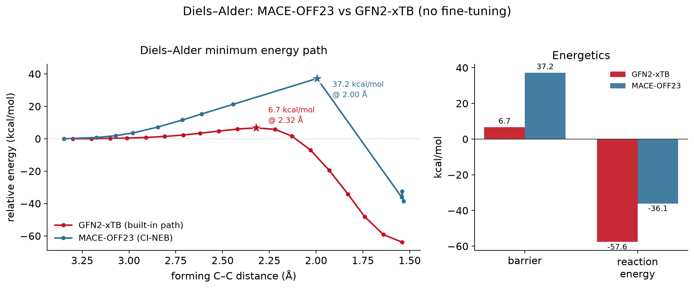

::: {.question}
[Scientific question]{.pillar-section-label}
Does the strong equilibrium agreement of [Pillar 1](p1-validation.qmd) survive
**bond-breaking and bond-forming chemistry**?
:::

## Why we tested it

Equilibrium water samples a smooth basin well inside any potential's comfort zone. A
cycloaddition does the opposite: it drives the system through half-formed bonds and
strongly distorted geometries. If a surrogate is going to carry *reactive* enhanced
sampling, this is the regime that decides it.

The benchmark is **butadiene + ethylene → cyclohexene**, chosen because GFN2-xTB gives
a fully characterized reference: a concerted, symmetric transition state verified by a
relaxed scan, a Sella saddle optimization, and a Hessian showing exactly one imaginary
mode.

## 1 · Raw reaction energetics {#sec-energetics}

| quantity | GFN2-xTB | MACE-OFF23 (CI-NEB) |
|---|:---:|:---:|
| activation barrier | **6.7 kcal/mol** | **36.2 kcal/mol** |
| reaction energy | −57.6 kcal/mol | −36.1 kcal/mol |
| TS forming C–C | 2.32 Å (symmetric) | 2.03 / 1.98 Å |

{width=700}

Both potentials place the transition state at essentially the same point on the
reaction coordinate, and both are far apart in energy. Neither is obviously "right":
experiment and DFT put the barrier at ≈22–27 kcal/mol and ΔH ≈ −40, so **xTB badly
underestimates the barrier while MACE overestimates it slightly** — a caveat that
matters for every later pillar, where xTB is used as a convenient *reference target*
rather than as ground truth.

## 2 · Mechanism and bond evolution {#sec-mechanism}

The disagreement is **not** mechanistic. Both potentials describe a concerted,
essentially synchronous cycloaddition in which the two forming bonds contract together.

{width=640}

## 3 · Force agreement {#sec-forces}

On rattled reaction-path geometries the two force fields point in nearly the same
**direction** (cosine ≈ 0.98) but differ in **magnitude**, and the gap is not uniform
along the path.

{width=640}

## 4 · The disagreement is localized {#sec-localization}

Partitioning 152 rattled path geometries into five regions by forming C–C distance
shows where the error actually lives.

| region (forming C–C) | force RMSE (eV/Å) | cosine | ΔE vs reactant (kcal/mol) |
|---|:---:|:---:|:---:|
| reactant basin (>2.9 Å) | 0.39 | 0.996 | 0 (ref) |
| pre-TS rising (2.4–2.9) | 0.43 | 0.991 | 8.7 |
| **TS region (1.96–2.4)** | **0.83** | **0.950** | **36.5** |
| **post-TS (1.7–1.96)** | **0.96** | 0.964 | 31.3 |
| product basin (<1.7 Å) | 0.33 | 0.997 | 23.1 |

{width=640}

::: {.keyresult}
[Key result]{.lbl}
Force error rises **~2.5–2.9×** in the TS/post-TS window (0.83–0.96 vs 0.33–0.43 eV/Å
in the basins), the cosine drops to **0.950**, and the energy discrepancy peaks in the
same place. The two potentials agree where the chemistry is easy and disagree
precisely where bonds are half-made.
:::

::: {.methodnote}
[Careful with the "why"]{.lbl}
That the error *concentrates* in the distorted barrier region is directly measured.
The natural explanation — that such geometries are under-represented in the foundation
model's training distribution — is a **supported hypothesis, not a demonstrated fact**.
This dataset shows *where* the error is, not *why*.
:::

## 5 · Ruling out a methodology artifact {#sec-identical-geometry}

The obvious objection: MACE used NEB, xTB used its own path search, so perhaps the gap
is just a path-method mismatch. Two independent tests close that off.

**Test A — MACE's barrier does not depend on the method.** Across the relaxed scan
(36.0), the Sella-refined saddle (36.2), and a standardized 13-image CI-NEB (36–37),
MACE gives the same answer, and the NEB result is numerically converged at
**35.9 ± 1.0 kcal/mol for ≥11 images**.

**Test B — evaluate both potentials on the identical frozen geometries.** Taking the
native xTB reactant, TS, and product and evaluating both potentials on those exact
structures removes path search entirely.

{width=620}

| on frozen xTB geometries | GFN2-xTB | MACE-OFF23 | difference |
|---|:---:|:---:|:---:|
| barrier | **6.7** | **27.9** | 21.2 kcal/mol |
| reaction energy | −57.6 | −36.2 | 21.4 kcal/mol |
| max force at the xTB TS | 0.00093 eV/Å | **1.84 eV/Å** | — |

The last row is the important one. xTB's TS is a true stationary point on xTB's own
surface, but MACE carries **1.84 eV/Å** of residual force there — nearly 40× a typical
0.05 eV/Å convergence threshold. **The xTB transition state is not a stationary point
on the MACE surface at all.**

::: {.methodnote}
[Method control — the standardized NEB]{.lbl}
Running *both* potentials through the identical 13-image CI-NEB (k = 0.5, FIRE /
`NEBOptimizer`, fmax 0.05, same concerted-scan seed) succeeds for MACE and **fails
physically for xTB**: the band does not form a sensible path, atoms in the "TS" images
separate to 7–18 Å, and the apparent barrier balloons to 240–250 kcal/mol under both
optimizers. This is an **algorithm/PES compatibility problem, not a backend failure** —
the same `xtb-python` build passes a stability gate with repeat-evaluation energy
scatter of 5.1e−14 eV. The valid xTB reference therefore remains the constrained
relaxed scan plus verified saddle. Details in [Study 04](04-diels-alder.qmd#sec-controls).
:::

## 6 · Cross-PES transition-state validation {#sec-ts-cross-pes}

If the xTB TS is not a MACE stationary point, where is the MACE saddle? Using the xTB
TS as a starting guess for a Sella saddle search on the MACE surface answers both that
and the robustness question.

{width=760}

| | GFN2-xTB saddle | MACE saddle (Sella from the xTB TS) |
|---|:---:|:---:|
| forming C–C | 2.315 Å | **2.004 Å** |
| barrier | 6.7 kcal/mol | **35.8 kcal/mol** |
| imaginary modes | 1 (−394 cm⁻¹) | 1 |
| convergence | — | 66 iterations, fmax 8e−6 eV/Å |

The recovered MACE saddle sits **0.316 Å** from the xTB one and agrees with the
*independently obtained* CI-NEB result (35.8 vs 36.0 kcal/mol; 2.004 vs 2.005 Å) —
two different methods from two different starting points landing on the same structure.

**Robustness.** Displacing the MACE saddle by ±0.02 and ±0.05 Å along its imaginary
mode and re-running Sella from each of the four perturbed structures recovers the same
saddle every time: barrier **35.806 kcal/mol in all four runs** (spread 0.000) and RMSD
to the reference below 1e−5 Å. The saddle is well isolated, not an optimizer artifact.

::: {.keyresult}
[Key result]{.lbl}
The barrier disagreement is a **genuine difference between the MACE and xTB
potential-energy surfaces**, not a path-search artifact. The two methods agree on
mechanism and place their saddles only 0.316 Å apart, but those are **distinct
stationary points with very different energies** — the xTB TS carries 1.84 eV/Å of
MACE force, and MACE's own saddle sits at 35.8 kcal/mol against xTB's 6.7.
:::

## What we learned

Same geometry region, same mechanism, different surface. Two claims that are easy to
conflate must be kept apart: **nearby TS geometry** and **matching TS energy** are
separate achievements, and this system has the first without the second.

Because the error is *localized* rather than global, a correction does not need to
repair the whole surface — only the barrier region. That is the premise of
[Pillar 3](p3-correction.qmd).

## Related studies

::: {.studylinks}
[Study 04 — Diels–Alder, full study](04-diels-alder.qmd){.primary}
[Methodological controls](04-diels-alder.qmd#sec-controls)
[Cross-PES TS validation detail](04-diels-alder.qmd#sec-cross-pes)
[Pillar 3 — correcting the gap](p3-correction.qmd)
:::
