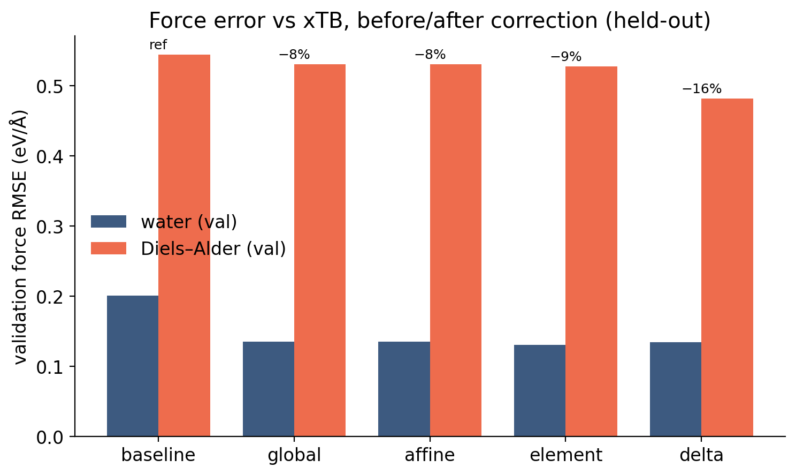
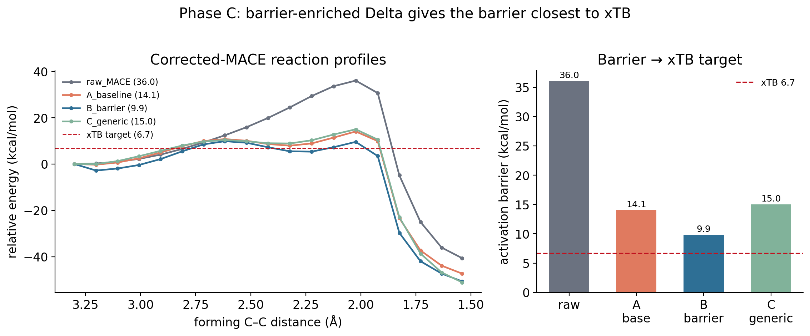

::: {.question}
[Scientific question]{.pillar-section-label}
Can a **lightweight post-training correction** adapt a pretrained MACE toward a chosen
reference, without fine-tuning the foundation model?
:::

## Why we tested it

[Pillar 2](p2-reactive.qmd) established two things that together make a correction
plausible. First, the disagreement is **systematic, not random**: force directions
already agree (cosine ≈ 0.98) and it is magnitude that is off. Second, it is
**localized** in the transition-state region rather than spread across the surface. A
systematic, localized residual is exactly the kind of thing a small model can absorb.

Fine-tuning MACE-OFF23 is deliberately off the table here — the point is to see how far
a cheap wrapper gets. Every correction below is applied through a `CorrectedCalculator`
that leaves the foundation model untouched.

The page follows the progression in order:

::: {.pipeline}
::: {.step}
**Raw MACE**
36.05 (scan max)
:::

[→]{.arrow}

::: {.step}
**Simple corrections**
global / affine / element: 32.3–36.0
:::

[→]{.arrow}

::: {.step}
**Conservative pairwise Δ**
11.66 (scan max)
:::

[→]{.arrow}

::: {.step}
**Barrier-enriched Δ**
9.87 (scan max)
:::

[→]{.arrow}

::: {.step}
**Certified saddle**
6.33 frozen xTB R · 8.23 model-relaxed R
:::
:::

Barriers in kcal/mol against an xTB reference of 6.7; "scan max" is the constrained
relaxed-scan maximum ([glossary](methods.qmd#sec-glossary)).

## 1 · Four correction architectures {#sec-architectures}

| model | form | conservative? |
|---|---|:---:|
| **global** | F′ = αF | yes |
| **affine** | F′ = αF, E′ = αE + β | yes |
| **element** | F′ᵢ = α(Zᵢ) Fᵢ, per element | **no** |
| **pairwise Delta** | ΔE = Σ fitted radial pair potentials; F = −∇ΔE | yes |

The Delta is a sum of Gaussian radial basis functions per element pair (48
coefficients across 6 pair channels, 3.6 Å cutoff), fit by ridge least-squares on the
**force residual** F_xTB − F_MACE. Being an energy expression differentiated
analytically, it is conservative and therefore safe for MD and metadynamics —
unlike per-element force scaling.

| model | held-out force RMSE ↓ | DA barrier (scan max) | reaction energy | droplet R_g |
|---|:---:|:---:|:---:|:---:|
| baseline MACE | ref | 36.0 | −40.6 | 3.94 Å |
| global / affine | 8% | 32.3 | −36.5 | 3.9–4.0 |
| element | 9% | 36.0 *(inert)* | −40.6 | 4.02 |
| **pairwise Delta** | **16%** | **11.7** | **−57.1** | 3.71 |
| **xTB (target)** | — | **6.7** | **−57.6** | **3.89**\* |

\* xTB R_g from this experiment's own reference run; other experiments' xTB runs give
3.77–3.78 Å ([why](p1-validation.qmd)).

Scalar corrections are too weak; element scaling is energetically **inert** (it
rescales forces without changing relative energies) and breaks conservativeness. Only
the pairwise Delta moves the energetics meaningfully.

{width=580}

## 2 · Where does calibration actually matter? {#sec-where}

If the error is concentrated at the barrier, the training data for the correction
should be too. Region-wise held-out force errors on a strict **no-leakage split by
parent path geometry** confirm the target:

| region | raw MACE | baseline Delta | barrier-enriched Delta | generic control |
|---|:---:|:---:|:---:|:---:|
| overall | 0.556 | 0.432 | 0.456 | **0.427** |
| **TS region** | 0.712 | 0.519 | **0.487** | 0.532 |
| **TS + post-TS** | 0.906 | 0.714 | **0.688** | 0.734 |

{width=640}

## 3 · Targeted versus generic data, at equal budget {#sec-targeted}

The controlled experiment: hold the architecture and hyperparameters fixed, and add
the **same number** of extra training configurations — 32 either way — placed either
in the barrier region (forming C–C ≈ 1.7–2.4 Å) or spread generically.

| model | barrier (constrained-scan max) | reaction energy | TS forming C–C |
|---|:---:|:---:|:---:|
| raw MACE | 36.0 | −40.6 | 2.02 Å |
| baseline Delta | 14.1 | −47.3 | 2.02 Å |
| **barrier-enriched Delta** | **9.9** | −50.7 | 2.62 Å |
| generic control (equal count) | 15.0 | −51.1 | 2.02 Å |
| **xTB (target)** | **6.7** | **−57.6** | 2.32 Å |

{width=700}

::: {.keyresult}
[Key result]{.lbl}
**Where the data goes matters more than how much of it there is.** Barrier-region
configurations moved the barrier 14.1 → **9.9**; the *same number* of generic
configurations did essentially nothing (14.1 → 15.0). The cost is a small increase in
*overall* held-out error (0.432 → 0.456) — the fixed-capacity Delta reallocates toward
the barrier.
:::

### Water is not damaged

| | O–O peak | droplet R_g |
|---|:---:|:---:|
| raw MACE | 2.84 Å | 3.90 Å |
| baseline Delta | 2.74 Å | 3.82 Å |
| **barrier-enriched Delta** | 2.74 Å | **3.82 Å** |
| xTB (Phase C reference run) | 2.84 Å | 3.77 Å |

{width=700}

Barrier enrichment leaves the equilibrium subsystem **identical** to the baseline
Delta. The reason is structural: the Delta has separate channels per element pair, so
added C–C/C–H barrier data touches only the carbon channels and leaves the O–O/O–H
channels that govern water alone. That channel separation buys clean selectivity.

## 4 · Scan versus saddle: a methodological refinement {#sec-scan-vs-saddle}

The 9.9 kcal/mol above is a **constrained-scan** barrier — the maximum along a path in
which both forming C–C distances are held equal and everything else relaxes. That is a
useful, cheap estimator, but the scan path is not guaranteed to pass through the true
saddle.

Running a proper **Sella first-order saddle search** on the *same* barrier-enriched
Delta model, and certifying it with a mass-weighted Hessian, gives a different and
better-founded number:

| estimator, same corrected model | reactant reference | barrier | forming C–C | certification |
|---|---|:---:|:---:|:---:|
| constrained-scan maximum | first scan point | 9.87 kcal/mol | 2.617 Å | not a stationary point |
| **certified first-order saddle** | **frozen xTB reactant geometry** | **6.33 kcal/mol** | **2.428 Å** | 1 imaginary mode, −358.3 cm⁻¹ |
| **certified first-order saddle** (same saddle) | **reactant relaxed on the corrected model** | **8.23 kcal/mol** | 2.428 Å | same |
| **xTB reference** | xTB-optimized reactant | **6.7 kcal/mol** | 2.315 Å | 1 imaginary mode, −394 cm⁻¹ |

::: {.keyresult}
[Key result]{.lbl}
Measured as a **certified saddle** rather than a scan maximum, the targeted Delta gives
**6.33 kcal/mol relative to the frozen xTB reactant geometry** and **8.23 kcal/mol
relative to the reactant relaxed on the corrected model**, against an xTB reference of
6.7 — differences of −0.37 and +1.53 kcal/mol. Its reaction mode is at −358.3 cm⁻¹
(xTB: −394) and it sits 0.173 Å (RMSD) from the xTB TS. This is the strongest one-shot
correction result in the project.
:::

::: {.methodnote}
[Why both reactant references matter]{.lbl}
The frozen reference evaluates the corrected model at the xTB reactant geometry; it asks
how the corrected surface scores the reference's own endpoints. The relaxed reference
lets the reactant find its minimum on the corrected surface first, so both ends of the
barrier are stationary points of the *same* model — the stricter internal-consistency
check. The 1.9 kcal/mol gap between them is itself a measure of how far the corrected
reactant basin still sits from the reference geometry. Neither number replaces the
other.
:::

::: {.methodnote}
[Both numbers are real — they measure different things]{.lbl}
**9.9 kcal/mol** is the constrained-scan estimator and remains the correct value for
that quantity; it is what earlier write-ups reported and it has not been withdrawn.
**6.33 kcal/mol** is the certified saddle on the same model. The scan overestimates by
≈3.5 kcal/mol here because its constrained path misses the saddle by ~0.19 Å in the
forming C–C coordinate. Both estimators are tracked separately throughout
[Study 08](08-corrections.qmd#sec-scan-vs-saddle); neither replaces the other.
:::

## What counts as a transition state? {#sec-ts-criteria}

Matching a barrier number is not enough: a scan maximum or an NEB image can sit at the
right energy without being a saddle point, and two different surfaces can give the same
barrier from different structures. On this site a structure is called a **certified
first-order saddle** only when every step below passes:

1. **Sella saddle search** (`order = 1`) converged, final force below 1e−4 eV/Å.
2. **Finite-difference Hessian** of the converged structure (central differences, 1e−3 Å).
3. **Mass-weighted** vibrational analysis — frequencies from M^−½ H M^−½, not raw Hessian
   eigenvalues.
4. **Exactly one significant imaginary mode** (below −50 cm⁻¹).
5. **The imaginary mode is the reaction**: forming C–C in 1.5–3.0 Å and overlap ≥ 0.30
   with the forming-bond coordinate.

Two of the six iterations in [Pillar 4](p4-iterative.qmd) converged in Sella but failed
step 4 (two imaginary modes); they are reported as uncertified. The full standard is on
the [Methods](methods.qmd#sec-ts) page.

## What we learned

A lightweight conservative correction, fit only on force residuals and applied without
touching the foundation model, can bring the corrected surrogate's **certified saddle to
within 0.4 kcal/mol (frozen xTB reactant) or 1.5 kcal/mol (model-relaxed reactant) of
the chosen reference** — and can do so with data concentrated in the region that
actually disagrees, without disturbing the water structure relative to the baseline
correction.

Two honest caveats. The reference here is xTB, which is not ground truth, and no
higher-level barrier has been established for this reaction in the project — so this
demonstrates **reference-matching, not improved physical accuracy**. And the corrected saddle still sits 0.173 Å from the xTB one —
energetic agreement is better than geometric agreement.

The obvious next question is whether the same targeting trick keeps paying off when
iterated. That is [Pillar 4](p4-iterative.qmd).

## Related studies

::: {.studylinks}
[Study 08 — Post-training corrections, full study](08-corrections.qmd){.primary}
[Barrier-region error localization](p2-reactive.qmd#sec-localization)
[Scan vs saddle detail](08-corrections.qmd#sec-scan-vs-saddle)
[Pillar 4 — iterating the correction](p4-iterative.qmd)
:::
