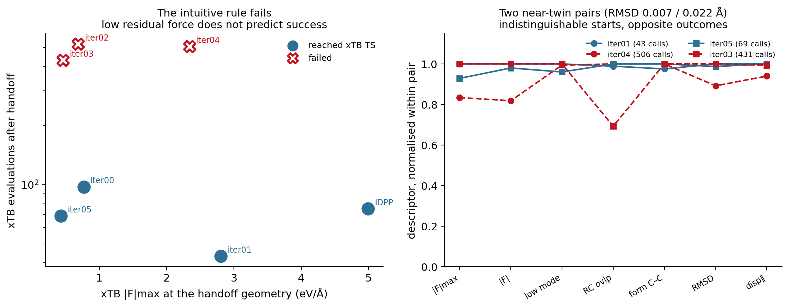

# Aug 21 diagnostics — is there an observable that tells us when to hand off?

**Tian's question.** What observable tells us when to stop ML correction and hand the
current structure to xTB/Sella?

**Answer: none that we can identify, and the data suggest none exists at this
resolution.** Two pairs of starting geometries separated by **0.007 Å and 0.022 Å**
RMSD — indistinguishable in every descriptor measured — produce opposite outcomes with
6–12× cost differences. The handoff outcome is not a continuous function of the starting
state at the scale that separates our candidates.

All numbers from `aug21_diagnostics/{reproducibility,descriptors,twin_pairs,
spearman_successes}.json`. Total additional cost: **777 xTB evaluations**.

## A. Reproducibility

Three replicates each, identical settings, fresh calculator per replicate:

| case | calls | median | range | deterministic? | outcome |
|---|---|:---:|:---:|:---:|---|
| iter01 | 44, 44, 44 | 44 | **0** | yes | reached TS, all 3 |
| iter02 | 519, 519, 519 | 519 | **0** | yes | not converged, all 3 |
| iter03 | 2079, 1351, 1934 | 1934 | **728** | **no** | failed, all 3 |

**The qualitative result reproduces**: iter01 cheap and reliable, iter02 stalls at a
fixed cost, iter03 fails. Sella is formally deterministic and behaves so for iter01/02.
iter03 does **not** reproduce its path: all three replicates dissociate the complex
(final forming C–C 4.03 / 4.92 / 5.21 Å) but by different routes. The mechanism is
numerical — xTB's threaded SCF gives bit-level differences that are amplified chaotically
on a flat, dissociative surface. Its cost should be read as "large and unstable", never
as a single number.

Replicates give 44/519 where the original benchmark recorded 43/520. The ±1 offset is an
accounting artifact: the original run shared one calculator across all cases, so an
occasional first evaluation hit the ASE cache. Fresh-calculator numbers (44, 519) are the
clean ones. This does not change any conclusion.

## B/C. Starting-state descriptors vs outcome

| case | success | calls | \|F\|max | E−E(TS) | lowest mode | n_imag | RC overlap | RMSD→TS |
|---|:---:|:---:|:---:|:---:|:---:|:---:|:---:|:---:|
| IDPP | yes | 75 | **4.993** | +52.32 | −283.5 | 3 | 0.475 | 1.141 |
| iter00 | yes | 97 | 0.770 | +3.26 | −201.8 | 4 | 0.474 | 0.173 |
| iter01 | yes | 43 | 2.805 | −8.64 | −636.5 | 3 | 0.709 | 0.143 |
| iter02 | **no** | 520 | 0.686 | +1.83 | −227.6 | 4 | 0.626 | 0.108 |
| iter03 | **no** | 431 | 0.461 | −1.37 | −188.4 | 3 | 7.0e−05 | 0.068 |
| iter04 | **no** | 506 | 2.340 | −4.61 | −632.9 | 3 | 0.717 | 0.127 |
| iter05 | yes | 69 | **0.428** | −1.44 | −181.0 | 3 | 1.0e−04 | 0.067 |

Full table with 14 descriptors: `aug21_diagnostics/descriptor_table.md`.

**The intuitive rule is wrong.** xTB residual force at the handoff geometry does not
predict success: IDPP has the **largest** |F|max (4.99 eV/Å) and succeeds in 75 calls;
iter05 has the **smallest** (0.43) and succeeds in 69; iter03 (0.46) and iter02 (0.69) are
small and fail. Low residual force is not a handoff-readiness signal.

**The decisive evidence — two near-twin pairs with opposite outcomes:**

| pair | Kabsch RMSD between them | median descriptor difference | outcomes | cost ratio |
|---|:---:|:---:|---|:---:|
| iter01 vs iter04 | **0.0217 Å** | 9.5% | 43 calls (OK) vs 506 (FAIL) | 11.8× |
| iter05 vs iter03 | **0.0068 Å** | 2.5% | 69 calls (OK) vs 431 (FAIL) | 6.2× |

iter05 and iter03 are the same cscan frame (forming C–C 2.5188 Å both) relaxed on
marginally different corrected surfaces. Their |F|max differ by 7%, energies by 5%, lowest
modes by 4%, displacement projections by 0.6%. One succeeds cheaply; the other dissociates
irreproducibly. **No descriptor evaluated at the starting geometry can distinguish them.**

**Spearman, successful cases only (n = 4 — reported because requested, not evidence):**
every coefficient has p ≥ 0.20; the largest |ρ| are 0.80 for force-fraction-along-RC,
E−E(TS), forming asymmetry, and displacement projection. With four points these are
consistent with noise and should not be quoted.

**The success/failure split is partly a threshold artifact.** From the saved logs, the
step at which each run first reaches fmax < 10⁻³:

| baseline | iter05 | iter01 | iter00 | iter02 | IDPP | iter04 | iter03 |
|:---:|:---:|:---:|:---:|:---:|:---:|:---:|:---:|
| 15 | 27 | 34 | 36 | **45** | 46 | **54** | **212** |

iter02 and iter04 reach 10⁻³ in 45 and 54 steps — comparable to the successes — then
spend 450+ further steps failing to reach 10⁻⁴. Their "failure" is the last factor of ten
in force convergence, not a wrong basin: both end at forming C–C 2.3153 Å, RMSD 0.0016 Å
from the xTB TS, barrier 6.71 kcal/mol. **The only genuine basin failure is iter03**
(1 of 7). We did not loosen the pre-registered fmax = 10⁻⁴; this is reported as
threshold sensitivity, not as a redefinition of the result.

## D. Candidate handoff criterion

**None is supported by these seven cases**, and the twin pairs argue that a
starting-state criterion is the wrong shape of solution: geometries 0.007 Å apart with
descriptors matching to 2.5% diverge completely. Whatever determines the outcome is not
resolvable in the starting state at the precision that separates real candidates.

Two further constraints on any such rule:

1. **Curvature descriptors are unaffordable as a rule.** An xTB Hessian costs 96
   evaluations — more than the entire iter01 handoff (44). Any practical criterion may
   use at most a single xTB call, i.e. energy and forces. Those are precisely the
   descriptors shown above not to separate the outcomes.
2. **The corrected-MACE descriptors do not help either.** `mace_xtb_force_rmse` is 0.75 for
   iter01 (success) and 0.61 for iter04 (failure); the corrected-MACE reaction-mode
   overlap is 0.64 vs 0.70. Neither ordering matches the outcome.

**What would plausibly work instead — an early-abort rule, not a handoff rule.** iter03's
failure is visible *during* the xTB run: it is the only case whose forming C–C leaves the
[1.5, 3.0] Å window, and it does so early. A cheap monitor — abort and fall back if
forming C–C exceeds 3.0 Å, or if fmax has not reached 10⁻³ within ~60 steps — would have
caught every expensive case in this set at a cost of a few tens of evaluations. That is a
run-time guard rather than a pre-handoff observable, and it is the only rule the present
data support.

**Minimum additional data to test any pre-handoff criterion:** the limiting factor is not
descriptor choice but sample size and the near-degeneracy of candidates. Testing a rule
would need on the order of 20–30 handoff candidates spanning a genuinely wider range of
starting geometries — ideally from more than one reaction, since all seven candidates here
collapse onto two or three distinct structures.

## E. What this answers for Tian

- **Are more Phase 2 correction iterations worthwhile?** No. Iterations 2–4 produce
  candidates that are no better, and by the pre-registered criterion worse, than
  iteration 0 or 1. This is consistent with Phase 2's own finding that iteration 0 was
  the best correction model.
- **Is local correction + xTB/Sella useful at all?** Qualified yes, but not because of
  the correction. All seven starting points — including the zero-cost IDPP interpolation —
  put xTB/Sella within ~30–100 evaluations of the TS. The correction is not what makes the
  handoff cheap; almost any physically sensible barrier-region structure does.
- **Is iteration 1 a reproducible sweet spot?** Reproducible, yes (44 calls, range 0
  across three replicates). A *sweet spot*, no. Its near-twin iteration 4 — 0.022 Å away —
  fails, and nothing measurable at the starting geometry distinguishes them. Iteration 1 is
  one favourable basin, not an identifiable optimum.
- **What metric determines the handoff point in advance?** None identified. The evidence
  points away from a pre-handoff observable and toward a run-time abort guard.

## F. Recommended next experiment

**Do not proceed to a richer correction model yet.** The premise of that step is that
better candidates would help, and these data do not support it: candidate quality barely
matters once the structure is in the barrier region, and the dominant cost is optimizer
behaviour rather than starting-point quality.

The cheap, decisive next experiment is instead to **test whether the handoff advantage
survives on a second reaction**. Everything here rests on one Diels–Alder system whose
seven candidates collapse onto two or three structures — which is exactly why the twin
pairs exist and why no descriptor can separate them. A second system would establish
whether "any barrier-region structure gets you within ~100 xTB calls" is general or an
accident of this surface. That is a far better use of effort than either a capacity
ablation or more Phase 2 iterations.

## G. Caveats

- One reaction, seven candidates, four successes. Nothing here is statistically
  established; this is exploratory mechanistic analysis, as scoped.
- iter03's cost is not reproducible (range 728 across replicates).
- The strict Hessian-cleanliness criterion remains unreliable on xTB's soft vdW modes; the
  saddle-identity criterion is used for success throughout.
- Phase 2 used a fixed, hand-specified query rule. **This is not active learning** and
  nothing here bears on active learning.
