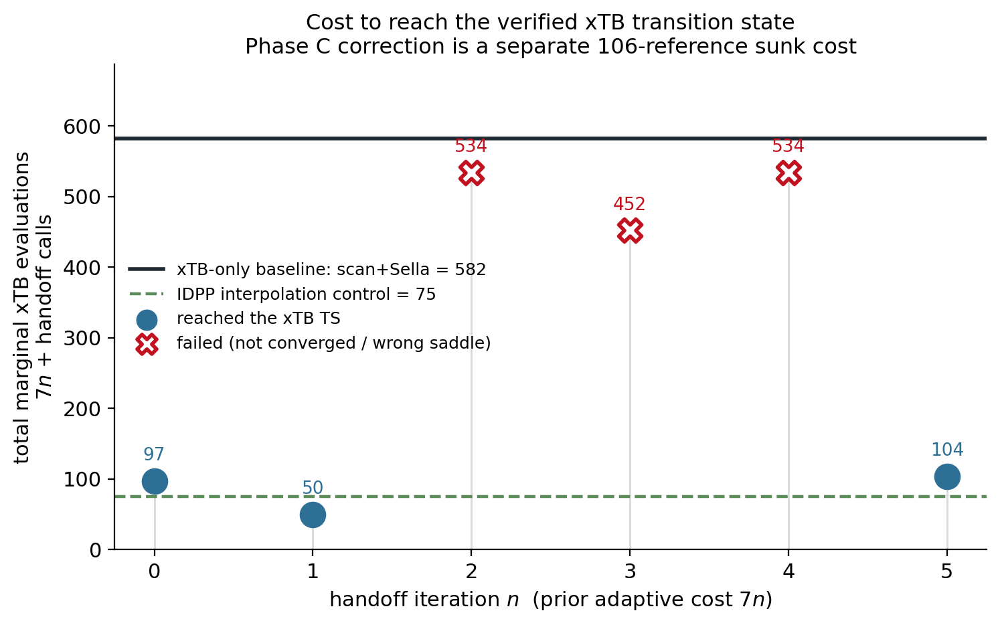
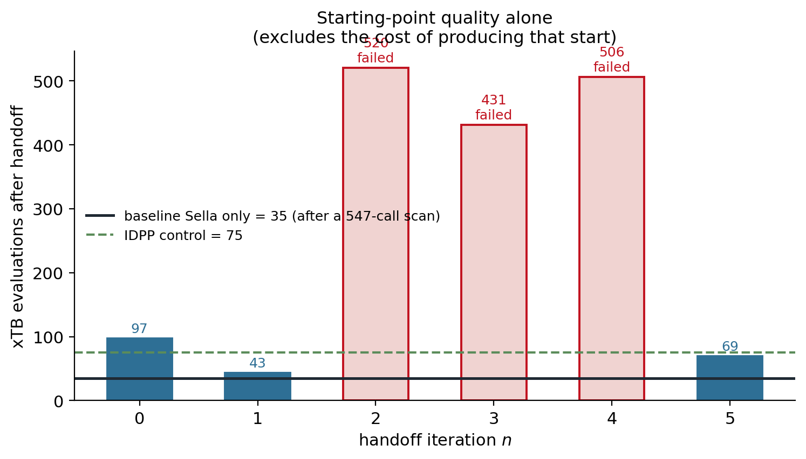

# Aug 21 — xTB/Sella handoff-cost benchmark

**Question.** Given the existing Phase C corrected-MACE model, does *continuing*
Phase 2 iterative sampling reduce the additional xTB evaluations needed to reach the
verified xTB transition state, and is there an optimal handoff iteration?

**Short answer.** Handing off from a corrected-MACE candidate can be much cheaper than
the xTB-only scan→Sella pipeline (50 vs 582 evaluations), but **only 3 of 6 handoffs
reach the TS at all, the successful ones show no trend in `n`, and a zero-cost IDPP
interpolation guess reaches the same TS in 75 evaluations** — beating two of the three
successful handoffs. Iterating the correction does not systematically reduce reference
cost.

All numbers below are read from `aug21_handoff/results.json`.

## Method

`aug21_handoff.py`, run inside `xtbenv` (ase 3.29.0, xtb-python 22.1, **sella 2.5.0** —
the same Sella version Phase 2 used). Identical settings for every case: Cartesian
coordinates, `order=1`, `fmax=1e-4`, `steps=500`, GFN2-xTB with
`electronic_temperature=1000`, `max_iterations=500`, `accuracy=1.0`.

**Cost metric.** `Calculator.calculate()` invocations, counted inside a `CountingXTB`
subclass. Verified in the smoke test: xtb-python returns energy *and* forces from one
`calculate()`, so one call is one SCF. `nsteps` undercounts by **1.0–2.0×** across these
runs (up to 3.7× in the smoke test) and is recorded only as a cross-check. Trajectory
frames are a lower bound — rejected Sella steps evaluate without writing a frame.

**Excluded from the cost:** Hessian certification (96 calls/case) and the reactant
reference energy. Both are verification, and every case including the baseline pays the
same, so they are a constant offset. They are recorded in `verification_xtb_calls`.

**Accounting.** Candidate `iterN/ts.xyz` is written *before* iteration N's own query
packet, so its prior adaptive cost is **7N, not 7(N+1)** (verified against the recorded
`n_train = 106 + 7N`). The 106 Phase C training references are a **separate sunk column**
and never enter the adaptive total.

## Results

| case | start type | prior refs | handoff calls | **total** | reached TS | strict Hessian | fmax | forming Å | barrier |
|---|---|:---:|:---:|:---:|:---:|:---:|:---:|:---:|:---:|
| baseline scan+Sella | xTB scan maximum | 547 (scan) | 35 | **582** | yes | 3 imag | 8.4e−05 | 2.3153 | 6.71 |
| iter00 | corrected-MACE saddle | 0 | 97 | **97** | yes | clean | 6.2e−05 | 2.3153 | 6.71 |
| **iter01** | corrected-MACE saddle | 7 | 43 | **50** | yes | 2 imag | 8.5e−05 | 2.3153 | 6.71 |
| iter02 | corrected-MACE saddle | 14 | 520 | **534** | **no** | — | 1.3e−03 | 2.3153 | 6.71 |
| iter03 | scan-max fallback | 21 | 431 | **452** | **no** | — | 7.0e−05 | 3.7378 | −0.20 |
| iter04 | corrected-MACE saddle | 28 | 506 | **534** | **no** | — | 4.9e−04 | 2.3153 | 6.71 |
| iter05 | scan-max fallback | 35 | 69 | **104** | yes | 3 imag | 8.2e−05 | 2.3153 | 6.71 |
| **IDPP control** | interpolation (zero cost) | 0 | 75 | **75** | yes | clean | 6.5e−05 | 2.3153 | 6.71 |

Every successful case converges to the **same** structure: forming C–C 2.3153 Å,
barrier 6.71 kcal/mol, principal imaginary mode −393.4 cm⁻¹ — the verified xTB TS
(2.315 Å, 6.7 kcal/mol, −394 cm⁻¹).

## What the experiment shows

**Directly demonstrated.**

1. **Only 3 of 6 handoffs reach the TS.** iter02 and iter04 reach the right structure but
   never tighten below `fmax=1e-4` within 500 steps (soft failure); iter03 converges to a
   *different* stationary point in the reactant basin (forming 3.738 Å, barrier −0.20,
   reaction-mode overlap 5e−05) — the same failure mode as Phase 2's naive-seed control.
2. **No trend in `n`.** Successful totals are 97 (n=0), 50 (n=1), 104 (n=5), with failures
   at n=2,3,4. There is no monotonic improvement and therefore **no identifiable optimal
   handoff iteration** — the pattern is erratic, not a curve with a minimum.
3. **The baseline's cost is dominated by the scan, not the saddle search**: 547 of 582
   calls. Once a good guess exists, Sella needs only ~35–97 calls.
4. **The IDPP interpolation control succeeded** in 75 calls with a clean Hessian, at zero
   prior reference cost.

**Interpretation.** Against the xTB-only scan→Sella pipeline, the best handoff (iter01,
50 calls) is 11.6× cheaper. But that comparison flatters the ML route, because the
baseline spends 94% of its budget on a relaxed scan that the IDPP control shows is not
actually necessary. **Measured against the cheapest working alternative (IDPP + Sella,
75 calls), only one of six handoffs is cheaper — and there is no way to know in advance
that it would be iteration 1.**

So: continuing Phase 2 iterative sampling **does not** systematically reduce reference
cost. This is consistent with the Phase 2 result that iteration 0 was the best correction
model and later iterations degraded.

**A prediction I got wrong.** The pre-experiment audit predicted the interpolation control
would fail, reasoning that `xtbpath_ts.xyz` (RMSD 0.898 Å from the TS) already fails and
the IDPP image is further away (1.174 Å). It did not fail — it was one of only two cases
with a clean Hessian. Distance from the TS is evidently a poor predictor of whether Sella
converges; basin topology matters more.

**Not demonstrated / caveats.**

- One reaction, one system, one correction family. Nothing here generalizes automatically.
- **iter03's cost is not reproducible**: 311 / 356 / 431 calls across three runs. It
  reliably fails to the same wrong basin, but the path length varies — expected for a
  floppy structure on a flat surface. Its cost should be read as "large and unstable",
  not as 431.
- The 547-call scan cost depends on the sequential relaxed-scan protocol chosen. A
  different scan schedule would give a different baseline.
- **This is not active learning.** Phase 2 used a fixed, hand-specified query rule with no
  acquisition function or uncertainty estimate.

## Methodological notes worth keeping

- **A first attempt at the baseline was invalid** and was discarded (retained as
  `results_PRE_FIX_invalid_scan.json`). It relaxed the existing `cscan/f_*.xyz` frames,
  which are *already* xTB-relaxed at exactly those constraints, so FIRE converged
  immediately — 1.00 calls/frame, a free scan. The corrected version walks the constraint
  down sequentially from `start.xyz`, each step seeded by the previous relaxed geometry,
  costing 28.8 calls/frame.
- **Strict Hessian certification is unreliable on this surface.** Structures that are
  demonstrably identical (same forming distance, same barrier, same −393.4 cm⁻¹ principal
  mode) intermittently show 1, 2, or 3 imaginary modes, because xTB's soft reactant-side
  vdW modes sit near the 50 cm⁻¹ cutoff. The benchmark therefore reports two independent
  verdicts: `reached_reference_saddle` (saddle identity: principal mode within 15 cm⁻¹ of
  −394, reaction-mode overlap ≥ 0.30, forming C–C in range, permutation-invariant
  structure match) and `certified_ts` (the strict Phase 2 Hessian-cleanliness criterion).
  Neither was loosened to help any run converge.
- **Kabsch RMSD is permutation-blind.** The IDPP control reports RMSD 0.9118 Å to
  `ts_opt.xyz` despite being the same saddle — an atom-relabelling artifact. The
  permutation-invariant distance signature confirms identity (0.0372 vs 0.0371 for
  iter00).

## Next question

The scan-dominated baseline and the successful IDPP control both point the same way: for
this system the expensive step is *generating a starting guess*, and cheap geometric
guesses work. A correction model earns its keep only if it produces starting points that
are reliably better — which, at 3/6 success, this one does not.
